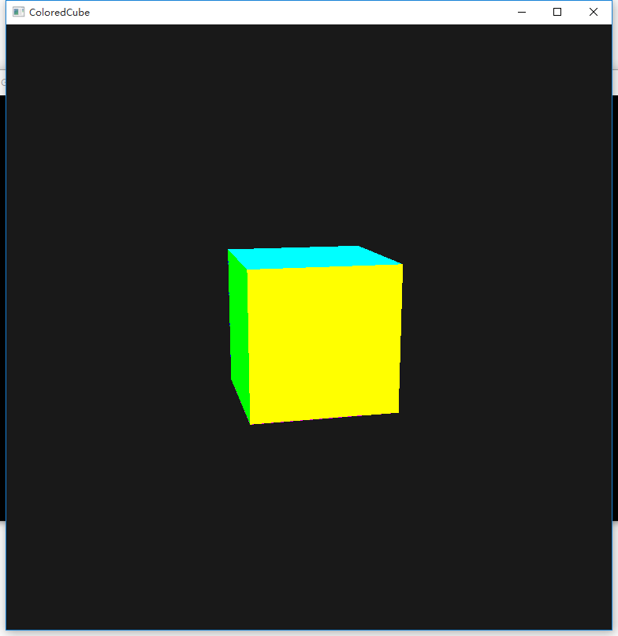
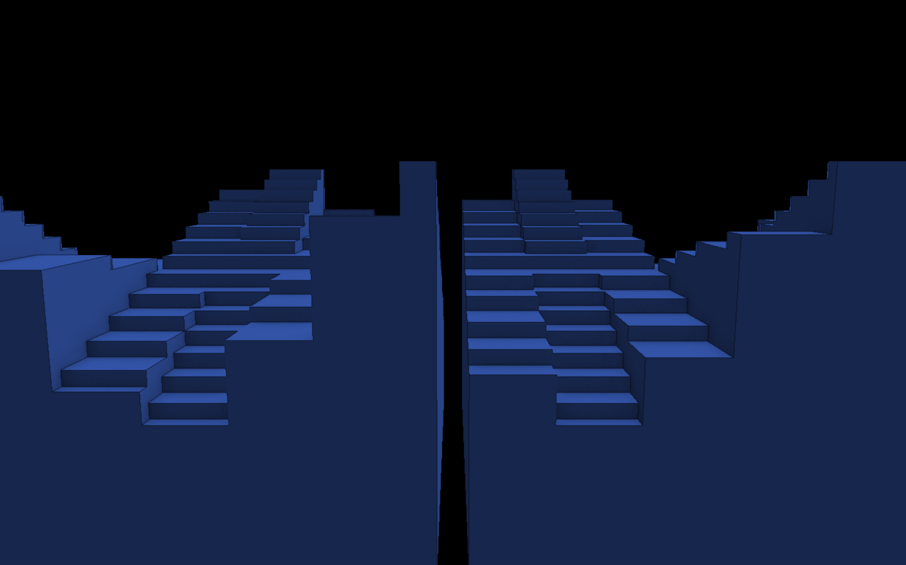

# Vulkan Voxel Test
Some Test Projects of a voxel engine for Vulkan.

## Compile
Now, there're only test projects.

They are divided into folders. Open them and open the *.sln file to run.

## Project List
### 01-Colored Cube

A Simple colored cube. Creating by following vulkan lunar-G samples.

### 02-Colored Voxels

Colored blocks.

In current version, there're two 32x32x32 dynamic chunks moving in the scene.

With Deferred shading and simple SSAO (and a 3x3 Gaussian blur with dotProduct > 0.9)

Block data in each chunk changes every 5 frames.

Average FPS on my 780mSLI: 450fps (renderDoc)

My FPS counter is incorrent. OTL.

  
Well I forgot to change application's title lol.
